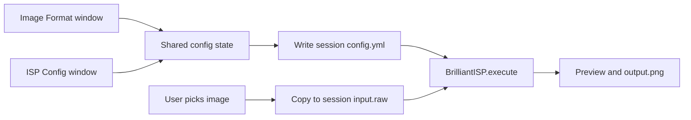

# BrilliantISP Calibration GUI Design

This document specifies a two-window calibration GUI for opening a RAW (or convertible) image, defining its format, tuning the ISP, and processing through the existing BrilliantISP pipeline.

It is a **design specification**. It does not implement the GUI. The current live tuner is [`tools/isp_tuning_gui.py`](../tools/isp_tuning_gui.py) (single window). This document is the target UX: **Image Format** + **ISP Configuration**, with a project-local session of YAML + RAW.

Related documents:

- [Algorithm Description Document v1.1](Algorithm%20Description%20Document%20v1.1.md) — module parameter definitions
- [ISP blocks and tuning](ISP_BLOCKS_AND_TUNING.md) — pipeline order and YAML keys
- [GUI additional requirements](GUI_DESIGN_Additional_Requirements.md) — session, state, validation, preview
- Example layouts: [`config/SVS_cam.yml`](../config/SVS_cam.yml), [`config/ROD_cam_daytime_le.yml`](../config/ROD_cam_daytime_le.yml)
- Pipeline entry: [`isp_pipeline.py`](../isp_pipeline.py), [`brilliant_isp.py`](../brilliant_isp.py)

---

## 1. Purpose

- Load any image from disk (RAW, and formats the loader already accepts such as TIFF / rawpy-supported files).
- Define sensor geometry, Bayer layout, bit depth, and file packing in an **Image Format** window modeled on a typical ISP calibration “IMAGE FORMAT” screen.
- Tune **all** ISP modules in a second window whose layout follows camera YAML (`SVS_cam.yml` / `ROD_cam_daytime_le.yml`) and whose controls cover Algorithm Description Document parameters plus BrilliantISP extensions.
- On Process, write a temporary YAML that the pipeline actually runs, and work on a temporary RAW copy stored inside this project so results are reproducible and independent of the original file path.

---

## 2. Architecture and workflow



1. User starts a session (or recovers the previous one).
2. User loads an image from anywhere on the computer. The GUI copies it to the session directory as `input.raw` (preserving bytes; the original is not modified).
3. Both windows edit one in-memory configuration object that **mirrors the camera YAML schema**.
4. Process validates, serializes that object to `config.yml`, runs `BrilliantISP` with the session data directory, and shows `output.png`.
5. Optional: load a `*_cam.yml` preset into shared state (merged with `config/base_hdr.yml` the same way the pipeline does today).

`platform.filename` for the run is the session copy name (`input.raw`). The data path passed to `BrilliantISP` is the session directory.

---

## 3. Session management

### 3.1 Actions

| Action | Behavior |
|--------|----------|
| **New Session** | Allocates `tmp/gui_session/<session_id>/`, writes default `config.yml` (from a chosen preset or `base_hdr` + empty overlay) and `session.json`. No `input.raw` until Load. |
| **Save Session** | Writes `config.yml` from shared state, `session.json` (GUI-only state), keeps `input.raw` if present. |
| **Open Session** | User picks a session directory; restores RAW, YAML, preview if `output.png` exists, and GUI state from `session.json`. |
| **Auto-Recover Previous Session** | On launch, if a last-session pointer exists and the directory is intact, offer restore. |

Last-session pointer (implementation detail): a small file such as `tmp/gui_session/last_session.json` containing the last `session_id`.

### 3.2 Session directory

```text
tmp/gui_session/<session_id>/
    input.raw
    config.yml
    output.png
    session.json
```

| File | Role |
|------|------|
| `input.raw` | Working copy of the loaded image |
| `config.yml` | Current ISP configuration (YAML is the source of truth) |
| `output.png` | Latest processed preview |
| `session.json` | GUI state that does **not** belong in YAML |

`session.json` holds items such as:

- original source path (for Reload)
- window geometry, which window is focused
- preview zoom / pan / fit mode
- last loaded preset path
- dirty / modified-parameter marks (or they can be recomputed vs. preset snapshot)
- Image Format UI-only fields until the loader supports them (header size, bit alignment)

Rationale: long tuning sessions can be resumed; a given `input.raw` + `config.yml` pair fully reproduces a result.

---

## 4. Internal data model

The GUI maintains **one shared configuration object** whose structure is the BrilliantISP camera YAML schema (same top-level keys as `SVS_cam.yml`).

```text
Image Format Window
          \
           --> Shared Configuration State  -->  config.yml  -->  BrilliantISP
          /
ISP Config Window
```

Rules:

- The YAML schema is the source of truth.
- The GUI is an editor for that schema. It must not introduce a second parallel configuration model.
- Image Format shortcuts (Apply AE, AWB, digital gain) write the same keys the ISP window uses (`auto_exposure.is_enable`, `auto_white_balance.is_enable`, `digital_gain.current_gain`).
- On Process: shared state → temp `config.yml` → `BrilliantISP`.
- `session.json` may store UI chrome only. If a value can live in YAML, it lives in YAML.

Required top-level keys for a processable config match `BrilliantISP._REQUIRED_CONFIG_KEYS` in [`brilliant_isp.py`](../brilliant_isp.py): `platform`, `sensor_info`, `dead_pixel_correction`, `companding`, `digital_gain`, `lens_shading_correction`, `bayer_noise_reduction`, `black_level_correction`, `white_balance`, `auto_white_balance`, `demosaic`, `auto_exposure`, `color_correction_matrix`, `gamma_correction`, `hdr_durand`, `tone_mapping`, `color_space_conversion`, `color_saturation_enhancement`, `ldci`, `sharpen`, `2d_noise_reduction`, `rgb_conversion`, `scale`, `crop`, `yuv_conversion_format`. Optional with defaults: `oecf`; tone-mapper sections (`hable`, `hable_integer`, `aces`, `aces_integer`, `reinhard_integer`) as used by the selected `tone_mapper`.

---

## 5. Parameter validation

Validate **before** Process. Invalid settings highlight the offending controls, show a clear error, and **must not** write `config.yml` or call `BrilliantISP`.

Minimum checks:

| Check | Rule |
|-------|------|
| Size | `sensor_info.width > 0` and `sensor_info.height > 0` |
| Crop | Crop rectangle is inside the sensor frame: `crop_x_start >= 0`, `crop_y_start >= 0`, `crop_x_start + new_width <= width`, `crop_y_start + new_height <= height`, `new_width > 0`, `new_height > 0` when crop is enabled |
| Bayer | `bayer_pattern` in `rggb`, `grbg`, `gbrg`, `bggr` |
| Bit depth | Positive integer consistent with loader (typical 8–24; HDR uses `hdr_bit_depth`) |
| Endian | `endian_type` is `ieee-le` or `ieee-be` |
| WB | `white_balance.r_gain > 0` and `white_balance.b_gain > 0` |
| Digital gain | Selected gain from `gain_array[current_gain]` is `> 0` (and index in range) |

Recommended additional checks (same behavior):

- Crop `new_width` / `new_height` even; `(width - new_width) mod 4 == 0` and same for height when crop is enabled (Algorithm Description Document crop rules).
- BNR `filter_window`, 2DNR `window_size` / `patch_size` odd when those modules are enabled.

---

## 6. Window A — Image Format

Layout matches a calibration “IMAGE FORMAT” screen: left column of grouped fields, lower-middle load/process shortcuts, large **preview** on the right. Title: `ISP calibration tool | Image format`.

### 6.1 Sensor / geometry

| UI control | YAML / session mapping |
|------------|------------------------|
| Sensor name | `sensor_info.sensor` |
| Workplace path + browse | Session working directory / browse for source files; not a pipeline key |
| Sensor width / height | `sensor_info.width`, `sensor_info.height` |
| Crop margins L-R-T-B | Converted to `crop`: `crop_x_start = L`, `crop_y_start = T`, `new_width = width - L - R`, `new_height = height - T - B`. Enabling non-zero margins sets `crop.is_enable: true` |
| Flip (H / V) | `sensor_info.horizontal_flip`, `sensor_info.vertical_flip` (applied after RAW/PGM load). 90° remains session-only if used. |
| Effective width / height | Read-only computed (see §7) |
| `rggb_start` + 2×2 CFA diagram | `sensor_info.bayer_pattern` |
| CFA channel names R/G/B | Labels for the diagram; pattern enum is what is saved |

Bayer mapping from start phase:

| `rggb_start` (UI) | `bayer_pattern` |
|-------------------|-----------------|
| 0 (R at 0,0) | `rggb` |
| 1 (G at 0,0, R at 0,1) | `grbg` |
| 2 (G at 0,0, B at 0,1) | `gbrg` |
| 3 (B at 0,0) | `bggr` |

The 2×2 color tiles update when the dropdown changes.

### 6.2 RAW packing

| UI control | Mapping |
|------------|---------|
| Header size (bytes) | `session.json` / planned `load_raw` skip; current loader does not consume a header field |
| Raw bit-depth | `sensor_info.bit_depth` |
| Data format (.raw only) | `sensor_info.data_format` (e.g. `uint16`); loader today infers packing from file size |
| Data alignment (MSB/LSB) | `sensor_info.data_alignment` (`MSB` = left-justified in the container, `LSB` = right-justified; default `LSB`) |
| Machine format | `sensor_info.endian_type`: `ieee-le` or `ieee-be` |

Also expose (can live in an “Advanced” row on this window or on ISP Config → sensor):

- `sensor_info.hdr_bit_depth`
- `sensor_info.pipeline_rgb_bit_depth`
- `sensor_info.output_bit_depth`
- `sensor_info.embedded_rows_top` / `embedded_rows_bottom`

### 6.3 Load and shortcuts

| Control | Behavior |
|---------|----------|
| Load test image | File picker (any path). Copy into session `input.raw`. Record source path in `session.json`. Enable preview of loaded RAW (mosaic or simple demosaic preview as available). |
| Reload test image | Re-copy from the original source path; do **not** reset ISP module parameters. Disabled if no source path. |
| Apply AE | `auto_exposure.is_enable` |
| AWB | `auto_white_balance.is_enable` (and keep `white_balance` apply path consistent with pipeline load: AWB enable drives auto gains) |
| Digital gain | `digital_gain.current_gain` (index) or display of `gain_array[current_gain]` with the index stored in YAML |

Toolbar: Save session, info / about.

### 6.4 Preview pane

The right-hand pane is a working viewer, not a static image dump.

**Required (initial implementation):**

- Fit to screen
- 1:1 zoom
- Zoom in / out
- Pan
- Refresh preview (re-read `output.png` or last processed buffer)

After Process, show the ISP output. Before the first Process, show the loaded RAW interpretation if possible.

**Future (layout should leave room; not initial scope):**

- Before / after comparison
- Split-slider comparison
- Blink comparison
- RGB histogram
- Luma histogram
- Pixel inspector
- ROI statistics

(`tools/isp_tuning_gui.py` already has Analysis histogram, stats, clip overlay, color picker, ROI; those belong in this future set or an Analysis menu on the same preview.)

---

## 7. Computed read-only fields

Update immediately when related parameters change.

| Field | Definition |
|-------|------------|
| Effective width | `crop.new_width` if crop enabled, else `sensor_info.width` |
| Effective height | `crop.new_height` if crop enabled, else `sensor_info.height` |
| Active pixel count | Effective width × effective height |
| Crop percentage | `100 * (1 - active / (width * height))` when crop enabled, else `0` |
| Estimated RAW size | `header_bytes + width * height * bytes_per_sample` (from bit depth / data format); show as bytes and MiB |
| Output resolution | `scale.new_width` × `scale.new_height` if scale enabled, else effective size; note `output_bit_depth` |

---

## 8. Window B — ISP Configuration

Second window (or a second top-level page with the same chrome): **ISP configuration**.

- Sections follow camera YAML order, grouped in **pipeline order** from [ISP_BLOCKS_AND_TUNING.md](ISP_BLOCKS_AND_TUNING.md).
- Each module: `is_enable` (where the schema has it), then Algorithm Description Document parameters, then BrilliantISP extras (`is_debug`, `is_save`, `is_plot_curve`, extra algorithms).
- Load preset: any `config/*_cam.yml`. Save / export YAML to a user path under `config/` or elsewhere.
- Process uses the shared state, not the preset file.

Pipeline order for the UI accordion / list:

1. Crop → 2. DPC → 3. BLC → 4. Companding → 5. OECF → 6. Digital gain → 7. LSC → 8. BNR → 9. AWB → 10. WB → 11. Tone mapping (before demosaic if flagged) → 12. Demosaic → 13. CCM → 14. Tone mapping (after CCM if flagged) → 15. AE → 16. CSC + saturation → 17. LDCI → 18. Sharpen → 19. 2DNR → 20. RGB conversion → 21. Gamma → 22. Scale → 23. YUV format

Tone mapping appears once in the UI with `tone_mapping.tone_mapping_before_demosaic` selecting placement.

### 8.1 Platform

| YAML key | Control |
|----------|---------|
| `filename` | Set from session (`input.raw`); read-only in UI |
| `disable_progress_bar`, `leave_pbar_string` | Checkboxes |
| `render_3a` | Checkbox |
| `save_format` | Dropdown (`png`, …) |
| `short_output_names` | Checkbox |
| `debug_enabled`, `debug_log_level`, `debug_log_file` | Debug group |
| `plot_histograms`, `histogram_show_log`, `histogram_show_channels` | Histogram group |

### 8.2 Sensor info

Covered primarily by Image Format. ISP window may repeat advanced bit-depth fields. Keys: `bayer_pattern`, `hdr_bit_depth`, `bit_depth`, `pipeline_rgb_bit_depth`, `width`, `height`, `output_bit_depth`, `sensor`, `endian_type`, `data_format`, `embedded_rows_top`, `embedded_rows_bottom`.

### 8.3 Modules from the Algorithm Description Document

Serialize using **BrilliantISP YAML names** (see §9). Include algorithm-doc fields even if the current YAML overlay omits them (store with pipeline defaults).

#### Crop (`crop`)

| Parameter | Notes |
|-----------|--------|
| `is_enable` | |
| `new_width`, `new_height` | Even; Bayer-safe crop |
| `crop_x_start`, `crop_y_start` | BrilliantISP ROI origin (not in algorithm-doc table) |
| `is_debug`, `is_save` | Extra |

Image Format L-R-T-B is the preferred editor for these four geometry keys.

#### Dead pixel correction (`dead_pixel_correction`)

| Parameter | Notes |
|-----------|--------|
| `is_enable` | |
| `dp_threshold` | Lower → more corrections |
| `is_debug`, `is_save` | Extra |

#### Black level correction (`black_level_correction`)

| Parameter | Notes |
|-----------|--------|
| `is_enable` | |
| `r_offset`, `gr_offset`, `gb_offset`, `b_offset` | |
| `is_linear` | Linearize after offset |
| `r_sat`, `gr_sat`, `gb_sat`, `b_sat` | Saturation |
| `is_save` | Extra |

#### OECF (`oecf`)

| Parameter | Notes |
|-----------|--------|
| `is_enable` | |
| `r_lut` (and per-channel LUTs if present) | Algorithm doc; optional until tuning LUTs ship |
| `is_save` | Extra |

#### Bayer noise reduction (`bayer_noise_reduction`)

| Parameter | Notes |
|-----------|--------|
| `is_enable` | |
| `filter_window` | Odd; algorithm doc name `filt_window` |
| `r_std_dev_s`, `r_std_dev_r` | Spatial / range |
| `g_std_dev_s`, `g_std_dev_r` | Gr/Gb |
| `b_std_dev_s`, `b_std_dev_r` | |
| `is_save` | Extra |

#### Digital gain (`digital_gain`)

| Parameter | Notes |
|-----------|--------|
| `is_enable` | YAML; not a named row in the algorithm-doc table |
| `is_auto` | Manual vs AE-driven index |
| `gain_array` | List editor |
| `current_gain` | Index into `gain_array` (starts at 0) |
| `ae_feedback` | `-1` under, `0` ok, `1` over |
| `exposure_correction_mode` | BrilliantISP (`direct`, …) |
| `is_debug`, `is_save` | Extra |

#### White balance (`white_balance`)

| Parameter | Notes |
|-----------|--------|
| `is_enable` | Apply gains |
| `is_auto` | Algorithm doc; pipeline may sync from AWB enable at load |
| `r_gain`, `b_gain` | Must be `> 0` |
| `is_debug`, `is_save` | Extra |

#### Auto white balance (`auto_white_balance`)

| Parameter | Notes |
|-----------|--------|
| `is_enable` | Estimate gains |
| `stats_window_offset` | `[Up, Down, Left, Right]`, multiples of 4 (algorithm doc; add if missing in overlay) |
| `underexposed_percentage`, `overexposed_percentage` | |
| `algorithm` | `grey_world` / `norm_2` / `pca` (match YAML values the module accepts) |
| `percentage` | PCA bright/dark fraction |
| `is_debug` | Extra |

#### Auto exposure (`auto_exposure`)

| Parameter | Notes |
|-----------|--------|
| `is_enable` | |
| `stats_window_offset` | Same convention as AWB |
| `center_illuminance` | Doc: 0–255; BrilliantISP often 0–1 fraction — GUI shows the YAML unit and labels it |
| `histogram_skewness` | Exposure decision band |
| `target_luminance` | BrilliantISP extra |
| `exposure_correction_mode` | BrilliantISP extra |
| `is_debug` | Extra |

#### Demosaic (`demosaic`)

Algorithm doc: always on, Malvar-He-Cutler, no parameters.

BrilliantISP:

| Parameter | Notes |
|-----------|--------|
| `algorithm` | `bilinear`, `malvar`, `vng_opt`, `hamilton_adams`, `ppg`, `ahd`, `lmmse`, … |
| `is_save` | Extra |

#### Color correction matrix (`color_correction_matrix`)

| Parameter | Notes |
|-----------|--------|
| `is_enable` | 3×3, rows often sum-to-1 |
| `corrected_red`, `corrected_green`, `corrected_blue` | Three-float rows |
| `is_save` | Extra |

#### Gamma correction (`gamma_correction`)

Algorithm doc: `gamma_lut_8/10/12/14`.

BrilliantISP YAML (what Process writes):

| Parameter | Notes |
|-----------|--------|
| `is_enable` | |
| `curve` | `gamma` or `srgb` |
| `gamma` | Exponent when `curve: gamma` |
| `is_save` | Extra |

Do not invent LUT tables in YAML unless the pipeline is extended.

#### Color space conversion (`color_space_conversion`)

| Parameter | Notes |
|-----------|--------|
| `conv_standard` | `1` = BT.709, `2` = BT.601 |
| `is_save` | Extra |

#### LDCI (`ldci`)

| Parameter | Notes |
|-----------|--------|
| `is_enable` | CLAHE-style |
| `clip_limit` | |
| `wind` | Tile / window size |
| `is_save` | Extra |

#### Sharpen (`sharpen`)

| Parameter | Notes |
|-----------|--------|
| `is_enable` | Algorithm doc `isEnable` |
| `sharpen_sigma` | `[1, 10]` |
| `sharpen_strength` | `[0.1, 2]` |
| `is_save` | Extra |

#### 2D noise reduction (`2d_noise_reduction`)

| Parameter | Notes |
|-----------|--------|
| `is_enable` | NLM |
| `window_size` | Odd; default 9 |
| `patch_size` | Odd; default 5 |
| `wts` | Strength 0–100 |
| `is_save` | Extra |

#### RGB conversion (`rgb_conversion`)

| Parameter | Notes |
|-----------|--------|
| `is_enable` | True: YUV→RGB out; False: YUV out |
| `is_save` | Extra |

#### Scale (`scale`)

| Parameter | Notes |
|-----------|--------|
| `is_enable` | |
| `new_width`, `new_height` | |
| `algorithm` | `Nearest_Neighbor` / `Bilinear` when not hardware path |
| `is_hardware` | Hardware-friendly size set |
| `upscale_method`, `downscale_method` | When `is_hardware` |
| `is_debug`, `is_save` | Extra |

#### YUV format (`yuv_conversion_format`)

| Parameter | Notes |
|-----------|--------|
| `is_enable` | |
| `conv_type` | `444` or `422` |
| `is_save` | Extra |

### 8.4 BrilliantISP extensions (not in the algorithm document)

The algorithm document listed LSC and tone mapping as future. BrilliantISP already requires them for a full config.

#### Companding (`companding`)

`is_enable`, `is_debug`, `pre_linearization_black_level`, `post_linearization_black_level`, `companded`, `companded_pin`, `companded_pout`, `is_save`. Legacy `pedestal` aliases pre. Pin/pout as paired list editors.

#### Lens shading (`lens_shading_correction`)

`is_enable`, per-channel `r_k1` `r_k2` `gr_k1` `gr_k2` `gb_k1` `gb_k2` `b_k1` `b_k2`, `is_save`.

#### Color saturation (`color_saturation_enhancement`)

`is_enable`, `saturation_gain`.

#### Tone mapping router (`tone_mapping`)

`is_enable`, `tone_mapping_before_demosaic`, `tone_mapper` (`hable_integer`, `hable`, `aces`, `aces_integer`, `reinhard_integer`, `hdr_durand`, …), `is_save`.

Show the parameter panel for the selected mapper; keep other mapper sections in YAML so switching mappers does not drop values.

| Section | Keys |
|---------|------|
| `reinhard_integer` | `is_enable`, `is_plot_curve`, `knee`, `strength`, `normalize_output` |
| `aces_integer` | `is_enable`, `is_plot_curve`, `exposure_adjustment`, `gamma`, `apply_odt_gamma`, `use_normalization`, `normalize_output`, `hdr_scale` |
| `hdr_durand` | `is_enable`, `is_save`, `is_debug`, `is_plot_curve`, `sigma_space`, `sigma_color`, `contrast_factor`, `downsample_factor` |
| `hable` | `is_enable`, `is_save`, `is_plot_curve`, `exposure_bias`, `white_point` |
| `hable_integer` | `is_enable`, `is_plot_curve`, `exposure_bias`, `white_point`, `use_normalization`, `normalize_output`, `hdr_scale` |
| `aces` | `is_enable`, `is_save`, `is_debug`, `is_plot_curve`, `variant`, `exposure_adjustment`, `output_transform` |

---

## 9. YAML compatibility

The GUI **must serialize the schema BrilliantISP loads**, not algorithm-document aliases.

| Algorithm document | BrilliantISP YAML |
|--------------------|-------------------|
| `filt_window` | `filter_window` |
| `isEnable` (sharpen) | `is_enable` |
| `gamma_lut_8/10/12/14` | `curve` + `gamma` |
| CFA always-on, no params | `demosaic.algorithm` |
| Center crop only | `crop_x_start`, `crop_y_start` |
| WB `is_auto` | Present in doc; overlays may omit — keep in shared state with pipeline default |
| AWB/AE `stats_window_offset` | May be absent in camera YAML — include with default `[0,0,0,0]` if the module supports it |

If a control is labeled with the document name, the stored key is still the YAML name.

`*_cam.yml` files merge over [`config/base_hdr.yml`](../config/base_hdr.yml) via [`util/config_merge.py`](../util/config_merge.py). Loading a preset in the GUI uses the same merge. Export of a session `config.yml` should be a **standalone** full config (all required keys) so Process does not depend on merge order. Optionally offer “Save as camera overlay” that writes only diffs from base.

---

## 10. Change tracking

Compare shared state to the **loaded preset snapshot** (the merge result at last Open Preset / New Session).

- Modified scalars show a trailing `*` and visual highlight, e.g. `R Gain = 1.95 *`.
- Unchanged values have no mark.

Actions:

| Action | Behavior |
|--------|----------|
| Show Modified Only | Hide controls equal to the preset |
| Reset Parameter | Restore one key |
| Reset Module | Restore one YAML section |
| Reset All | Restore entire snapshot (does not delete `input.raw`) |

`session.json` can cache the snapshot path; the snapshot itself is a deep copy of the last loaded YAML.

---

## 11. Process, temp artifacts, export

On **Process** (enabled only after a successful Load and passing validation):

1. Serialize shared state to `tmp/gui_session/<id>/config.yml`.
2. Ensure `input.raw` exists in that directory.
3. Construct `BrilliantISP(data_path=session_dir, config_path=session_config.yml, …)` and `execute(img_path="input.raw")` (or equivalent).
4. Copy or write the pipeline PNG to `output.png` and refresh the preview.

**Save / Export config** writes a user-chosen YAML (does not have to stay in `tmp/`). **Save output** copies `output.png` (or the pipeline `out_frames/` result).

Do not mutate the user’s original RAW or the original preset file unless they explicitly Save over that path.

### 11.1 Future processing modes (not initial scope)

Documented so the Process control can grow without redesign:

- Run Full Pipeline (initial)
- Run From Demosaic
- Run From CCM
- Run From Sharpen
- Run Selected Module

---

## 12. Relationship to existing code

[`tools/isp_tuning_gui.py`](../tools/isp_tuning_gui.py) already provides Blocks/Parameters tabs, auto-reprocess, Save All, and Analysis tools. This design splits **format vs ISP**, adds a **session directory** (`input.raw` + `config.yml` + `output.png` + `session.json`), full algorithm-doc coverage, validation, and change tracking.

Implementation should reuse `load_merged_yaml` / `pipeline_config_paths` and `BrilliantISP.execute` rather than a second ISP.

---

## 13. Test cases

There is no pytest tree in the repo yet. These IDs are the verification matrix for a later `tests/gui/` (logic/YAML automated) plus a short manual preview checklist.

Fixtures: [`config/SVS_cam.yml`](../config/SVS_cam.yml), [`config/ROD_cam_daytime_le.yml`](../config/ROD_cam_daytime_le.yml), and a **synthetic tiny RAW** with known width, height, and bit depth (not production captures).

### 13.1 Session management

| ID | Name | Expected |
|----|------|----------|
| TC-S01 | New Session | Creates `tmp/gui_session/<session_id>/` with default `config.yml` and `session.json`; no `input.raw` until load |
| TC-S02 | Load Image Copies RAW | File from an arbitrary path is copied to `input.raw`; original unchanged; `platform.filename` is the copy |
| TC-S03 | Save Session | Writes `config.yml` from shared state and `session.json` (zoom, dirty flags, last preset); keeps `input.raw` |
| TC-S04 | Open Session | Restores RAW, YAML, `output.png` if present, and GUI state |
| TC-S05 | Auto-Recover | After unclean exit, next launch offers the last session directory and restores it |
| TC-S06 | Process Writes Artifacts | Process writes `config.yml` and `output.png`; pipeline data path is the session directory |

### 13.2 Shared configuration state

| ID | Name | Expected |
|----|------|----------|
| TC-M01 | Single Object | Changing `sensor_info.width` in Image Format is the value serialized and shown for ISP Config |
| TC-M02 | AE/AWB Shortcuts | Apply AE / AWB / digital gain write `auto_exposure.is_enable`, `auto_white_balance.is_enable`, `digital_gain.current_gain` |
| TC-M03 | YAML Source of Truth | Load `SVS_cam.yml` or `ROD_cam_daytime_le.yml` → shared state → serialize; all required BrilliantISP keys present; no invented top-level sections |

### 13.3 Validation (Process blocked)

| ID | Name | Expected |
|----|------|----------|
| TC-V01 | Size | `width` or `height` ≤ 0 fails |
| TC-V02 | Crop bounds | Crop rectangle outside the sensor fails |
| TC-V03 | Bayer | Pattern not in `rggb`/`grbg`/`gbrg`/`bggr` fails |
| TC-V04 | Bit depth / endian | Invalid bit depth or endian fails |
| TC-V05 | Gains | WB gains or digital gain ≤ 0 fail |
| TC-V06 | UX | Offending controls highlighted, error message shown, YAML not written, `BrilliantISP` not called |

### 13.4 Image format and computed fields

| ID | Name | Expected |
|----|------|----------|
| TC-F01 | CFA mapping | `rggb_start` / diagram writes `sensor_info.bayer_pattern` |
| TC-F02 | Crop margins | L-R-T-B convert to `crop_x_start`, `crop_y_start`, `new_width`, `new_height` |
| TC-F03 | Computed fields | Effective size, active pixels, crop %, estimated RAW size, output resolution update when size/crop/bit-depth/scale change |

### 13.5 ISP config coverage

| ID | Name | Expected |
|----|------|----------|
| TC-C01 | Algorithm-doc modules | Crop, DPC, BLC, OECF, BNR, DG, WB, AWB, AE, demosaic, CCM, gamma, CSC, LDCI, sharpen, 2DNR, RGB conversion, scale, YUV each have enable (where applicable) and listed parameters |
| TC-C02 | BrilliantISP extras | Companding, LSC, saturation, tone mappers, demosaic algorithm, AE extras, gamma `curve`/`gamma` |
| TC-C03 | YAML names | Serialize `filter_window` not `filt_window`; `is_enable` not `isEnable`; gamma as `curve`/`gamma` not LUT tables |

### 13.6 Change tracking

| ID | Name | Expected |
|----|------|----------|
| TC-T01 | Dirty mark | Values that differ from the loaded preset show `*` / highlight |
| TC-T02 | Show Modified Only | Hides unmodified controls |
| TC-T03 | Reset | Reset Parameter / Module / All restore preset values and clear marks |

### 13.7 Preview (manual)

| ID | Name | Expected |
|----|------|----------|
| TC-P01 | Navigation | Fit, 1:1, zoom in/out, pan, Refresh after Process |
| TC-P02 | Future tools | Before/after, split-slider, blink, histograms, pixel inspector, ROI — out of initial scope |

### 13.8 Pipeline integration

| ID | Name | Expected |
|----|------|----------|
| TC-I01 | Process | Valid session runs `BrilliantISP` on session `input.raw` + `config.yml` (unit tests may mock `execute`) |
| TC-I02 | Export | User-chosen YAML is loadable by `load_merged_yaml` / `BrilliantISP` (required keys) |
| TC-I03 | Reload | Re-copies RAW from the original path and does not reset ISP module settings |

---

## 14. Out of scope for this document

- Implementing the Tkinter/Qt windows
- Adding pytest under `tests/gui/`
- Extending `load_raw` for arbitrary header-size skip (alignment is now `sensor_info.data_alignment`)
- Incremental “run from module N” processing
